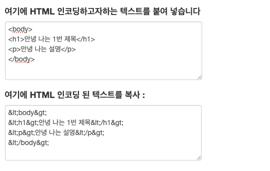
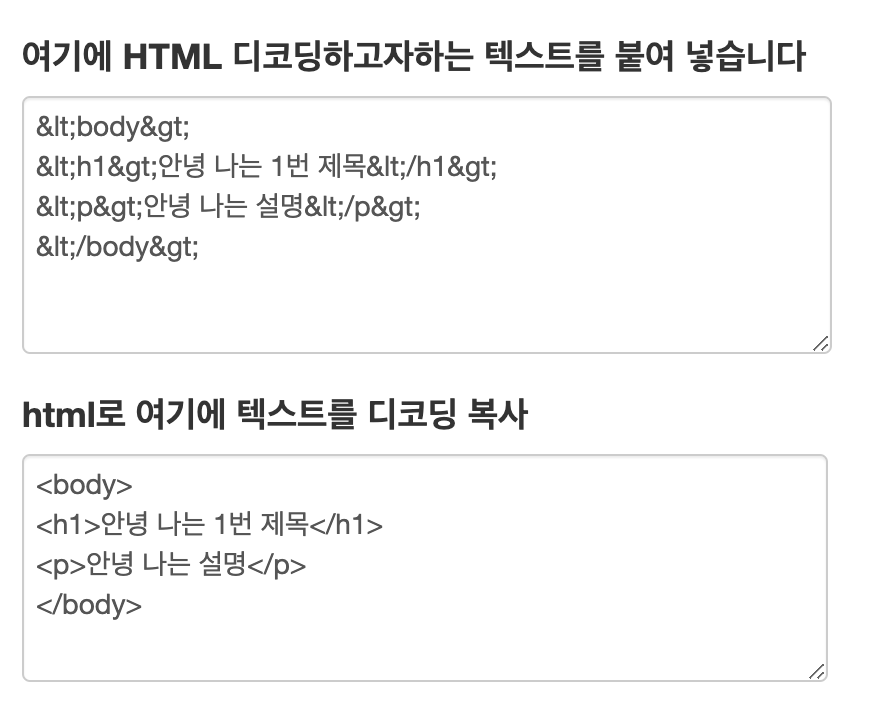

# 브라우저의 랜더링 순서

웹 브라우저는 HTML 문서를 해석하고, 화면을 통해 해석된 결과를 보여준다.
이걸 가능하게 하는 것이 바로 `렌더링 Rendering`.

# 렌더링이란?

: HTML, CSS, 자바스크립트 등의 리소스가 브라우저에서 출력되는 과정

## 렌더링 엔진

- 크롬 : 블링크(Blink)
- 사파리 : 웹킷(Webkit)
- 파이어폭스 : 게코(Gecko)

# 렌더링 과정


유저가 브라우저를 통해 웹사이트에 접속하면 서버로부터 HTML, CSS 등 웹사이트에 필요한 리소스를 다운로드 받는다.

브라우저가 페이지를 렌더링하기 위해서는 HTML코드는 **DOM 트리**, CSS는 **CSSOM 트리**를 생성해야한다.

- `DOM(Document Object Model)`
  html 문서에 대한 인터페이스로 스크립트 언어와 프로그래밍 언어를 통해 웹 문서를 쉽게 제어하기 위해 문서를 객체화한 것을 말한다.
- `CSSOM(CSS Object Modal)`
  위와 동일하게 사용자가 CSS 스타일을 동적으로 읽고 수정할 수 있는 방법.

## 1. HTML 파싱 -> DOM 트리 생성

### 1-1. 바이트코드 -> 문자로 변환 (Bytes -> Characters)

**`인코딩`**
"문자를 바이트로"
문자를 컴퓨터가 이해할 수 있는 바이너리 데이터로 변환하는 과정.



**`디코딩`**
"바이트를 문자로"
변형된 형태로 저장된 파일을 원래 상태로 되돌리는 것, 복호화.



#### 이때 변환이 필요한 이유?

HTML 문서 안에는 스크립트와 같이 특수한 기능을 하는 문자들이 포함되는데, 게시판이나 웹 메일 등에 아래와 같은 코드를 input에 넣었을 때 작동하는 경우가 있다.(특수문자들이 그대로 전송이 되기 때문에) <br/>

```
js <script>alert("스크립트를 직접 넣어서 XSS 테스트합니다");</script>
```

이는 매우 위험하다.
스크립트가 포함된 게시글을 타 유저가 클릭하는 것만으로도 공격을 가할 수 있고,
또는 공격자가 스크립트를 포함한 URL을 유저에게 노출시켜서 서버에 스크립트가 포함된 URL로 데이터를 요청하고, response 또한 해당 스크립트를 포함하게 될 수 있다.

또는 게시글을 클릭하는 것 자체만으로도 공격이 전송되게

유저는 특정 게시글만 클릭해도
스크립트를 넣어 기능을 동작시키는 위와 같은 **_`XSS(Cross Site Scripting)` 이슈의 방어 대책_**으로 HTML 인코딩을 사용한다.

### 1-2. 토큰화

### 1-3. 렉싱

### 1-4. DOM 생성

## 2. CSSOM 트리 생성

HTML과 동일한 과정

## 3. 렌더 트리 생성

## 4. Composite

위의 내용을 한 흐름으로 이해하기에는 제주코딩베이스캠프의 아래 영상이 매우 좋습니다 👍
[브라우저는 어떻게 화면을 렌더링할까] (https://www.youtube.com/watch?v=z1Jj7Xg-TkU)

---

# 브라우저 랜더링 기술적으로 뜯어보기

# 정리 : 웹 브라우저에 URL을 입력하면 무슨 일이 일어나는가?

## 참고

- [면접에서 브라우저 렌더링을 묻는 이유] (https://www.reason-to-code.com/blog/why-do-they-ask-about-browser-rendering/)
- [DOM, CSSOM 누구보다 쉽게 설명해보기] (https://taeyoungcoding.tistory.com/3)
- [브라우저의 렌더링 과정] (https://medium.com/%EA%B0%9C%EB%B0%9C%EC%9E%90%EC%9D%98%ED%92%88%EA%B2%A9/%EB%B8%8C%EB%9D%BC%EC%9A%B0%EC%A0%80%EC%9D%98-%EB%A0%8C%EB%8D%94%EB%A7%81-%EA%B3%BC%EC%A0%95-5c01c4158ce)
- [인코딩(Encoding)이란 ? : ASCII, URL, HTML, Base64, MS Script 인코딩] (https://ghdwn0217.tistory.com/76)

- [웹 브라우저에 URL 입력하면 일어나는 일 - 인프라 위주] (https://www.youtube.com/watch?v=GAyZ_QgYYYo)
- [브라우저는 어떻게 화면을 렌더링할까] (https://www.youtube.com/watch?v=z1Jj7Xg-TkU)
- [문자열을 변환해볼 수 있는 사이트] (https://www.convertstring.com/ko/EncodeDecode/HtmlDecode)
